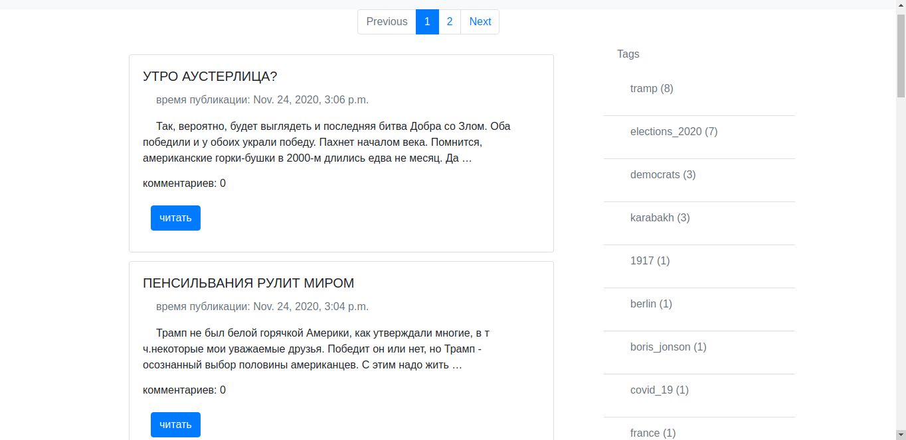

## Test task simple Posts project on django.
- Post: title, publication date, text.
- Post added by standard django-admin. 
- Per 10 posts on page.
- Tags created and added to post by django-admin.
- Everybody can write comment.
- At front posts can by filtered by tags.
- Near the post are shown comments count.
## Get start
Clone project form github and create environments: 
```commandline
python3 -m venv .venv
```
Install requirements:
```commandline
pip install -r requireemnts.txt
```
To start project:
```commandline
python3 manage.py runserver
```
## PreView

